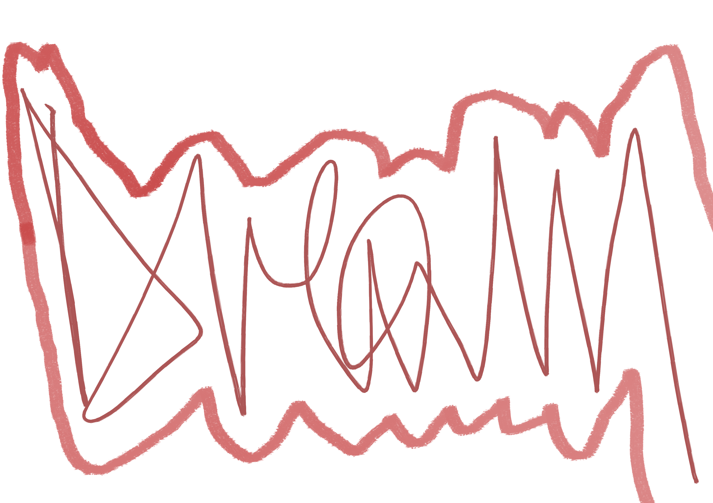

# Preface

## Hej!

This book will guide you through topics around hacking web applications.

We will be following the content on [Portswigger](https://portswigger.net/web-security/learning-path),
[Hack The Box](https://hackthebox.com), [Try Hack Me](https://tryhackme.com),
[EchoCTF](https://echoctf.red/), [Vulnhub](https://www.vulnhub.com/) and 
[Cohackers](https://cohackers.co/learn) learning path, so you might register and
test yourself as we'll go and get their original content and exploits.

At the end of _the book_ you should be able to follow any learning path of mentioned
services, or try to tackle a bigger challenge which might be a certification exam or 
writing a resume to land a real job. You choose!

Szymon and 🎶


```text
commercial usage prohibited,
any other usage allowed with attribution.
```

```text
(educational usage allowed in schools that directly supports students financially - 
for example MIT and Harvard are not allowed, because the are charging for educational 
services. Following this, they let some students to learn for free, 
using so called scholarship - which in fact is a discount on price of education, 
thus only schools that are not charging for they services are allowed to use this 
content, unless MIT or Harvard-like school would pay student some kind of 
'scholarship' that lands in her bank account or directly in a pocket, and she's 
free to do what she wants with it - 
I'm OK, if this is course for such group of students, not for all school - it
could even be 10$, I'm not picky on some law bending).
```

```text
If a Harvard, or MIT-like school would like to use this content, I propose 
a course where they do not charge before the course is finished, and then they 
charge for the course, after the student finds a job, and is able to pay 
for the course.
```

> Szymon Bronisław Błaszczyński ©️ 2023

<iframe src="https://github.com/sponsors/NutekSecurity/card" title="Sponsor nutek-terminal" height="225" width="600" style="border: 0;"></iframe>